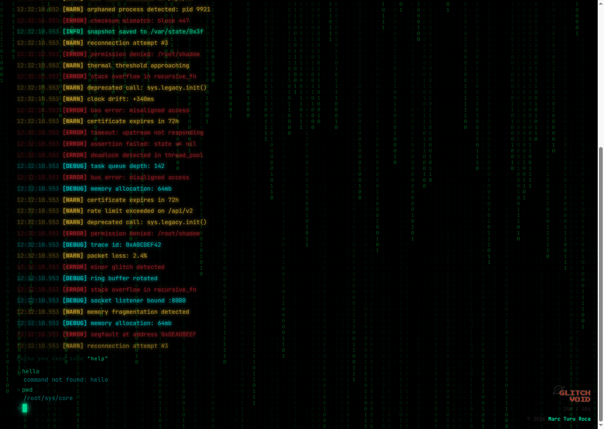
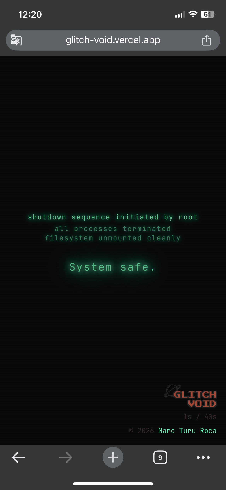

#  — Your terminal is dying. Can you save it?


<sub>🗓️ Developed in February 2026</sub>

This project consists of a **Next.js-based web game**.    
It implements a retro terminal that boots up, starts logging — and slowly falls apart. Errors creep in, the signal degrades, and after a few seconds the system collapses into the void, but there's a way to save it. Built with **Next.js 16**, **React 19**, **TypeScript 5.7**, and **Tailwind CSS 4** — featuring animated binary rain, CRT scanlines, a custom cursor, and a self-evolving terminal log simulation with a ticking clock.

---

## ✅ Features

- **Terminal Simulation**: A living, breathing terminal interface (`terminal-simulation.tsx`) that autonomously generates and collapses log lines over time, mimicking a system spiralling into glitch entropy.
- **Custom Cursor**: Blinking terminal-style cursor (`cursor.tsx`) for an authentic retro aesthetic.
- **Log Lines**: Individually styled log entries (`log-line.tsx`) that appear and decay as the simulation progresses.
- **CRT Scanlines**: Retro scanline overlay effect (`scanlines.tsx`) replicating the look of an old cathode-ray tube monitor.
- **Binary Rain**: Animated binary background (`binary-rain.tsx`) rendered as a visual layer beneath the terminal.

---

## 🛠 Installation & Setup

### a0. Prerequisites

Make sure you have installed:
- **Node.js >= 18**
- **npm** or equivalent package manager

Check versions:
```bash
node -v
npm -v
```

### a1. Clone the repository
```bash
git clone https://github.com/marcturu/glitch-void.git
cd glitch-void
```

### a2. Install dependencies
```bash
npm install
```

### a3. Run locally
```bash
npm run dev
```
Then visit `http://localhost:3000`.

### b1. Try the web game
Visit: [https://glitch-void.vercel.app/](https://glitch-void.vercel.app/)

---

## 📂 Project Structure

```
├── 📁 app
│   ├── 🎨 globals.css
│   ├── 📄 layout.tsx
│   └── 📄 page.tsx
├── 📁 components
│   ├── 📁 terminal
│   │   ├── 📄 binary-rain.tsx             ← Animated binary background layer
│   │   ├── 📄 cursor.tsx                  ← Blinking terminal cursor
│   │   ├── 📄 log-line.tsx                ← Individual animated log entries
│   │   ├── 📄 scanlines.tsx               ← CRT scanline overlay effect
│   │   └── 📄 terminal-simulation.tsx     ← Core simulation logic & orchestration
│   ├── 📁 ui
│   └── 📄 theme-provider.tsx
├── 📁 hooks
│   ├── 📄 use-mobile.ts
│   └── 📄 use-toast.ts
├── 📁 lib
│   └── 📄 utils.ts
├── 📁 public
├── ⚙️ .gitignore
├── 📝 README.md
├── ⚙️ components.json
├── 📄 next-env.d.ts
├── 📄 next.config.mjs
├── ⚙️ package-lock.json
├── ⚙️ package.json
├── 📄 postcss.config.mjs
└── ⚙️ tsconfig.json
```

---

## 📷 Screenshots 

### Gameplay (Desktop):


### Gameplay (Mobile):

